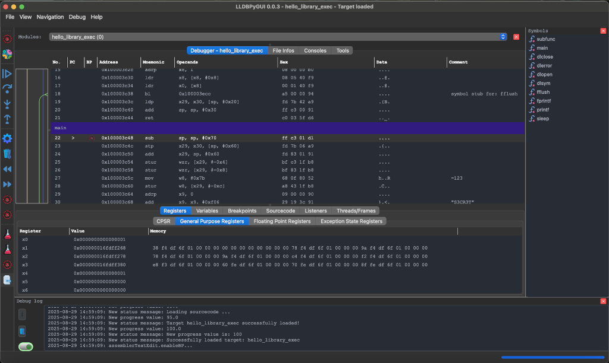

# LLDBGUI - Variables

LLDBGUI features some essential and really helpful shortcuts (keyboard and click) you don't want to miss. They are part
of the Key-Concept of LLDBGUI and make your life working with the app way easier.

## Overview

- Copy text under cursor - Shift click

<!--  -->

## Copy text under cursor (all widgets)

Almost all texts in almost all widgets you can copy by pressing Shift combined with a click.

## Synopsis

LLDBPyGUI is a longtime missed GUI of mine for the open source debugger (framework) LLDB. While LLDB comes with a
comprehensive set of tools and also a C++ and Python API. It lacks of providing a useful (at least for me) GUI as it's
only working as a terminal application at the present time. So I took some time and started a Python GUI wrapper project
that is using the Python API of LLDB and began to implement a UI with the help of PyQt6. The project is still in a
really early prototype stage at the moment, but I didn't want to let you miss the idea of mine and give you a short
sneak-preview of the tool I have in mind.

## Movie Trailer

## Features

- General info about the target
- Disassembler / Debugger
- Stacktrace viewer
- Break- and Watchpoints
- Register / Variable viewer
- Synchronized source code
- Memory viewer
- Search function
- Commands interface

## Documentation

### Shortcuts and Tricks

#### Copy texts to clipboard - Shift + Click

Almost all texts in any view or widget can be copied to clipboard with shift + click on it.

## Download / Github

- [Source code at GitHub](https://github.com/jetedonner/pyLLDBGUI)

<!-- - Zip file from mirror -->

## Credits

- [developer.arm.com](https://developer.arm.com/documentation){:target="_blank" rel="noopener"}
- [Mach-O Wikipedia](https://en.wikipedia.org/wiki/Mach-O){:target="_blank" rel="noopener"}